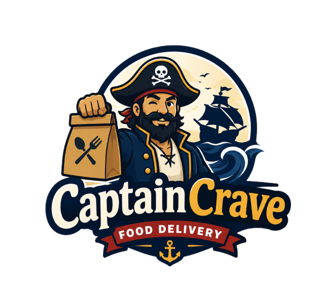

<p align="center">
  
</p>

<h1 align="center">CaptainCrave</h1>

<p align="center">A full-stack food ordering platform, browse restaurants, explore menus, and place orders.</p>

<p align="center">
  
  
  
  
  
</p>

---

## Overview

CaptainCrave connects customers with local restaurants. Customers can browse restaurants nearby, view menus by category, and place orders. Restaurant owners can manage their listings, menus, and categories through a protected API. The platform is built with an Angular frontend and an ASP.NET Core backend.

---

## Tech Stack

| Area | Technology |
|---|---|
| Frontend | Angular 21, TypeScript |
| Backend | ASP.NET Core 10, C# |
| Database | SQL Server, Entity Framework Core 10 |
| Auth | JWT Bearer, BCrypt |
| Testing | xUnit, Moq |

---

## Backend Architecture

The backend follows **Clean Architecture** each layer has one responsibility and only depends on the layer beneath it.

```
Controller -> Service -> Repository -> Database
```

| Layer | Folder | Responsibility |
|---|---|---|
| Controllers | `Controllers/` | Receive HTTP requests, validate input, return responses |
| Services | `Services/` | Business logic, orchestration |
| Repositories | `Repositories/` | Database queries via EF Core |
| Models | `Models/` | EF Core entities mapped to tables |
| DTOs | `DTOs/` | Data shapes at the API boundary |
| Mappers | `Mappers/` | Convert between models and DTOs |

Controllers never touch the database directly. Services never know about HTTP. Repositories never contain business rules.

### Local secrets for Backend

From the `Backend` folder, set these user-secrets before running the API:

```powershell
dotnet user-secrets set "Jwt:Secret" "replace-with-a-long-random-secret"
dotnet user-secrets set "ConnectionStrings:DefaultConnection" "Server=(localdb)\\MSSQLLocalDB;Database=CaptainCrave;Trusted_Connection=True;TrustServerCertificate=True;"
```

`Jwt:Secret` must be at least 32 bytes for `HS256`, so use a long random value.

For full backend details see [Backend/README.md](Backend/README.md).

---

## Tests

Unit tests live in the `Backend.Tests/` project and cover all API controllers.

| Tool | Purpose |
|---|---|
| xUnit | Test framework |
| Moq | Mock service dependencies so tests run with no database or HTTP pipeline |

Each controller test class follows the same pattern: create a mock service, inject it into the controller, set up the mock to return a fixed value, call the controller method, and assert the result type and body.

Run all tests:

```bash
dotnet test
```

For more detail see [Backend.Tests/README.md](Backend.Tests/README.md).


---

## Documentation

| README | Contents |
|---|---|
| [README.md](README.md) | Project overview, architecture summary, test summary, local secrets |
| [Backend/README.md](Backend/README.md) | Backend/API architecture, authentication flow, EF Core migrations, running the API |
| [Backend.Tests/README.md](Backend.Tests/README.md) | Test stack, folder structure, why `[Fact]`, running and filtering tests |
| [Client/README.md](Client/README.md) | Angular frontend setup, development server, build and test commands |